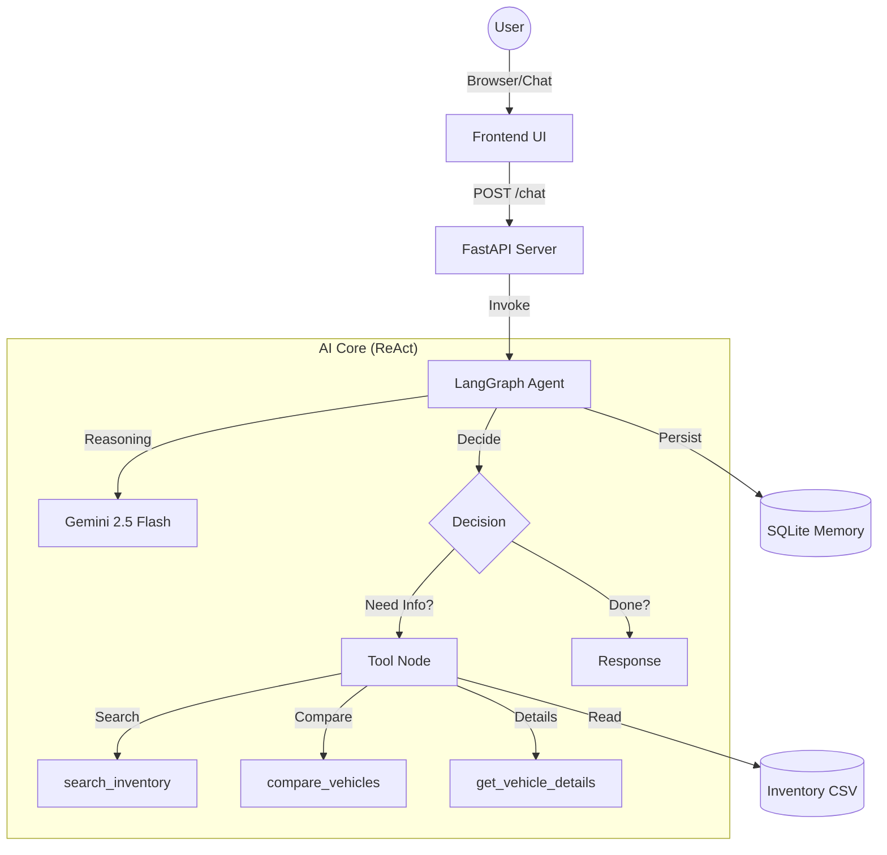

# 🚛 BAS World — AI Tractor Head Finder Case

> **An Enterprise-Grade AI Chatbot** designed to help customers find the perfect tractor head from BAS World's global inventory. Built with **LangGraph**, **FastAPI**, and **Terraform**, featuring a premium "Agency-Quality" frontend.

[](https://www.python.org/)
[](https://fastapi.tiangolo.com/)
[](https://langchain-ai.github.io/langgraph/)
[](https://www.terraform.io/)
[](https://www.docker.com/)

---

## 🎯 Case Objective

Build an AI-powered chatbot that:
1.  **Converses naturally** with users (English/Dutch/Spanish).
2.  **Asks targeted questions** to clarify vague needs (e.g., "long distance").
3.  **Searches inventory** using structured filters mapped from natural language.
4.  **Provides expert advice** on tractor head specifications.
5.  **Deploys as an API** with full IaC (Terraform).

**Status:** ✅ **Completed & Exceeded Requirements** (Added full Premium Frontend)

---

## 📚 Documentation & Verification

For a detailed breakdown of how this solution meets every requirement of the case study, please refer to:

*   **[✅ Solution Verification (`solution_verification.md`)](solution_verification.md)**: Explicit mapping of case study objectives to code implementation.
*   **[🛡️ Solution Defense (`solution_defense.md`)](solution_defense.md)**: Technical "Sustento" explaining architecture choices and trade-offs.

---


## 🏗️ Architecture

### High-Level Design



### AWS Infrastructure (Terraform)
Deploys to a production-ready ECS Fargate cluster:
*   **Networking:** VPC, Public Subnets, Security Groups
*   **Compute:** ECS Cluster, Fargate Task Definition (0.5 vCPU, 1GB RAM)
*   **Storage:** S3 (for CSV/Logs), ECR (Docker Images)
*   **Monitoring:** CloudWatch Logs (14-day retention)

---

## 🧠 Agent Capabilities

The agent performs **Real-time Reasoning (ReAct)** using 3 core tools:

| Tool | Capabilities |
|---|---|
| **`search_inventory`** | Maps natural language ("comfortable", "heavy load") to 18+ filters (cabin type, axle config, HP, Euro norm). Excludes damaged/sold units. |
| **`compare_vehicles`** | Generates side-by-side markdown tables for 2-5 vehicles, highlighting key differences (Price, Mileage, Specs). |
| **`get_vehicle_details`** | Deep-dive into a single vehicle's full spec sheet. |

### "Human-Like" Behaviors implemented:
*   **Context Memory:** remembers budget/brand across turns.
*   **Progressive Search:** Broad search first → narrow filters only if asked.
*   **Fault Tolerance:** Automatically handles missing data (e.g., skips unreliable columns like `has_airco`).
*   **Consultative Advice:** Uses internal domain knowledge to guide users even before searching (e.g., "For heavy loads, look for 6x4 configuration").

---

## 💻 Tech Stack

- **Backend:** Python 3.11+, FastAPI, Uvicorn
- **AI Framework:** LangChain / LangGraph
- **LLM:** Google Gemini 2.5 Flash (via OpenRouter)
- **Database:** SQLite (Conversation Memory), Pandas (Inventory Data)
- **Frontend:** HTML5, CSS3 (Glassmorphism), Vanilla JS
- **Infrastructure:** Terraform, Docker, AWS (simulated via LocalStack)

---

## 🚀 Quick Start

### 1. Prerequisites
- Python 3.11+
- [OpenRouter API Key](https://openrouter.ai/)

### 2. Installation
```bash
git clone https://github.com/bas-world/chatbot.git
cd bas_world

# Create virtual env
python -m venv venv
venv\Scripts\activate

# Install dependencies
pip install -r requirements.txt
```

### 3. Configuration
Create a `.env` file:
```env
OPENROUTER_API_KEY=sk-or-v1-your-key-here
OPENROUTER_MODEL=google/gemini-2.5-flash
LOG_LEVEL=INFO
```

### 4. Run Locally
```bash
# Start the server
uvicorn app.api.main:app --host 0.0.0.0 --port 8888 --reload
```
Open **http://localhost:8888** in your browser.

---

## 🧪 Demo Scenarios (Tested)

### Scenario A: Vague Needs
> **User:** *"I need a truck for international transport"*
> **Agent:** Asks for budget and brand preferences before searching. Recommends: 4x2, Euro 6, Sleeper Cab.

### Scenario B: Specific Specs
> **User:** *"Volvo FH 500, Euro 6, Automatic, under €45k"*
> **Agent:** Executes precise search. Returns 5 matching cards.

### Scenario C: Refinement & Comparison
> **User:** *"Show me cheaper options"* -> *"Compare the first two"*
> **Agent:** Updates filters (lowers max_price), then calls comparison tool on the new results.

### Scenario D: Expert Advice
> **User:** *"What do you advise for heavy construction loads?"*
> **Agent:** Suggests 6x4 axle, 500+ HP, and strong suspension. Explains *why*, then offers to search.

---

## 📂 Project Structure

```
bas_world/
├── app/                  # Core Logic
│   ├── agents/           # LangGraph Agent & System Prompts
│   ├── tools/            # Inventory Search & Compare Tools
│   ├── api/              # FastAPI Endpoints
│   └── services/         # Data Loading & LLM Client
├── data/                 # trekkers.csv (Inventory)
├── frontend/             # Premium Chat Interface
├── infra/                # Terraform (AWS)
└── tests/                # Pytest Suite (19 tests)
```

---

## ⚖️ Trade-offs & Future Work

*   **Single-Agent vs Multi-Agent:** We chose a **single ReAct agent** for speed and simplicity. A multi-agent system (Router -> Specialist -> Reviewer) matches the complexity of this domain but adds latency.
*   **Search Engine:** Using **Pandas** for the CSV is blazingly fast for 673 records. For 1M+ records, we would switch to **PostgreSQL + pgvector**.
*   **Memory:** **SQLite** is perfect for local/single-server. For horizontal scaling, we would swap the checkpointer to **Redis**.

---

<div align="center">
  <b>Built for the BAS World AI Engineering Case</b><br>
  <i>Showcasing authentic design, robust engineering, and agentic AI.</i>
</div>
